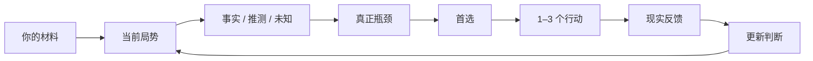

# 求职军师 · Career Junshi

> 不只帮你改简历，更帮你判断：现在到底该做什么。


[](LICENSE)
[](documentation/MEMORY.md)
[](documentation/MEMORY.md)

[English](README_EN.md) · [合成案例](cases) · [评测与限制](#评测与限制)

一个以证据为依据的职业决策 Agent，以本地 Skill 的形式运行在 Codex 等支持 Skill 的助手中。
把简历、JD、项目经历、HR 对话、面试反馈或 Offer 交给它，直接问：**“我现在最值得做什么？”**
它先判断当前局势与真正瓶颈，再给出首选、1–3 个行动，以及继续、停止或转向的条件。

- “明天下午二面，我今晚准备什么？”
- “HR 五天没回，要不要催？”
- “AI Product、Technical PM 和 Quant，我该主投哪个？”
- “这段经历到底能不能写‘主导’？”
- “两个 Offer 怎么选？”

## Quick Start：安装，然后直接提问

需要支持本地 Skill 的宿主（如 Codex）；辅助脚本需要 Python 3.10+，只用标准库。
本项目没有自建模型服务，也不要求额外的 API key；对话能力由宿主提供。

**第一步：让 Codex 安装。** 把下面这段话粘贴给它：

```text
请从 https://github.com/lavine888/Career-Junshi 的 main 分支
安装 career-junshi 本地 Skill。

使用仓库的 scripts/install_skill.py，选择当前宿主实际扫描的 Skill 目录。
先检查已有同名安装，不要覆盖。
安装完成后运行验证。
不要替我启用长期记忆。
```

**第二步：开始一个新聊天。** 附上你愿意提供的简历和 JD，再粘贴：

```text
请使用 $career-junshi。

这是我的简历和 JD。
我明天下午二面，今晚还有 4 个小时。

先判断我现在最大的风险是什么，
然后告诉我今晚最值得做的 1–3 件事，
以及哪些事情不要浪费时间准备。
```

没有完整资料也可以开始：说清当前阶段、目标、已有经历和截止时间。
它应先读已给材料，只补问会改变建议的信息。偏好自己安装？见[手动安装](#手动安装)。

## 五种用法

| 场景 | 直接这样问 | 希望得到什么 |
| --- | --- | --- |
| ① 岗位方向 | “AI Product、Technical PM、Quant，主投哪个？” | 主投 / 副投 / 探索，证据与缺口，市场验证动作 |
| ② 面试防守 | “明天下午面试，我今晚准备什么？” | 最高风险、最多三个主动作、贡献 / 架构 / 故事防守 |
| ③ 经历与简历 | “这段经历能不能写‘主导开发’？” | Claim 审计、可辩护的表述、可能追问 |
| ④ 招聘进度 | “HR 五天没回，是不是挂了？” | 事实与推测、是否跟进、可发送草稿、停止等待条件 |
| ⑤ Offer 决策 | “两个 Offer 怎么选？” | 当前倾向、决定性未知、什么会反转选择 |

这些是工作流目标，不保证每次判断正确。材料、贡献范围和行动条件仍需核对。

**适合：** 校招或社招中的复杂选择、有真实项目但难以讲清的人、临近面试需要收敛准备的人，
以及希望持续复盘方向、Offer 和求职反馈的人。

**不承担：** 自动海投、替你面试、编造项目经历、预测 Offer 概率。
投递、发送消息、谈薪与接受 / 拒绝 Offer 由你执行。

## 为什么使用求职军师？

求职问题常常需要先判断：在当前证据和约束下，下一步最值得做什么。
下面比较的是工作流侧重点，不是对 ChatGPT 或其他模型能力的排名。

| 只问一次“帮我改简历”时的关注点 | Career Junshi 的工作流 |
| --- | --- |
| 把文案写好 | 先判断方向、证据、定位、面试、市场或时机，哪个是真正瓶颈 |
| 整理用户提供的故事 | 区分事实 / 推测 / 未知，自述不等于独立核实 |
| 增强经历的表现力 | 保留团队、个人贡献与项目阶段的边界 |
| 列出可以改进的地方 | 优先 1–3 个行动，说明哪些工作暂时不值得做 |
| 处理当前这份材料 | 经同意后，用本地 Decision → Outcome 记录复盘 |
| 交付一版简历 | 尽量给首选、反转条件、观察窗口和停止线 |

## 30 秒看懂工作流



记忆可选；不开记忆，也可以把新反馈带回对话，重新判断。

## 一个完整例子

以下为**合成的工作流示意**，不是独立模型评测或真实面试结果。

**输入**

> 明天下午 AI 产品二面。一面深入问了我的文档检索原型架构，我感觉答得一般。
> 项目由团队完成，我负责评测与失败分类，服务由队友实现。JD 要求解释架构取舍。
> 今晚还有 4 小时。

**我的判断**

今晚优先守住这个项目的架构取舍、个人贡献和失败模式。
已有追问信号值得准备，但“感觉答得一般”还不能证明你技术能力不足。

**现在做三件事**

1. 用 30 分钟核对简历中的贡献与项目阶段，准备一条准确表述：
   “参与团队文档检索原型，负责评测与失败分类。”这是按自述整理，仍需贡献证据。
2. 用 90 分钟练五层追问：做了什么、为什么、替代方案、怎么测量、什么失败了。
   架构只讲你理解和参与过的部分，不替队友领功。
3. 用 45 分钟练一段 90 秒项目故事，记下答不上来的边界，剩余时间留给休息。

**不要做：** 今晚不要新建项目或重新学一整套 Agent 框架。

**观察与停止：** 到计划结束就停止准备。面试后记录实际追问和明确反馈，再调整下一轮。
**反转条件：** 若招聘方明确二面改为商业 case，重新分配准备时间。

更多完整材料与产物：[面试](cases/interview) · [HR 跟进](cases/follow-up) · [Offer](cases/offer)。

## Evidence First：不帮你吹经历

强表述应该经得起追问。先检查证据，再调整措辞：

| Claim 可信度 | 含义 |
| --- | --- |
| VERIFIED | 已针对这条精确主张核查直接证据，表述仍受核查范围限制 |
| SUPPORTED | 有支持材料，但未完整独立核实 |
| SELF_REPORTED | 来自本人陈述，尚未独立核实 |
| PLANNED | 计划或未完成工作，不能写成既成成果 |

局势判断另分 **FACT / INFERENCE / UNKNOWN**：有来源的观察或陈述、推断、尚未确认的信息。
FACT 标签不是独立真实性认证，链接或源码存在也不证明个人作者身份。

```text
团队成果 ≠ 你独立实现
Demo ≠ Production
回测 ≠ 实盘
参赛 ≠ 获奖
没有回复 ≠ 被拒
面试通过 ≠ 某个准备策略导致通过
```

证据弱，就补证或收窄表述。脚本不能认证虚构的核查记录，文本规则也不能替代语义审阅。
详细契约见 [Evidence](documentation/EVIDENCE.md)。

## 手动安装

先下载**稳定 main** 并验证仓库：

```sh
git clone --branch main https://github.com/lavine888/Career-Junshi.git
cd Career-Junshi
python scripts/validate_skill.py
```

再选择宿主实际扫描的目录。Codex 用户级目录为 `~/.agents/skills`，见
[OpenAI 官方 Skill 文档](https://learn.chatgpt.com/docs/build-skills)。其他宿主按自身配置选择。

**macOS / Linux**

```sh
python scripts/install_skill.py --target "$HOME/.agents/skills/career-junshi"
python "$HOME/.agents/skills/career-junshi/scripts/validate_skill.py" --runtime-only
```

**Windows PowerShell**

```powershell
python scripts/install_skill.py --target "$env:USERPROFILE\.agents\skills\career-junshi"
python "$env:USERPROFILE\.agents\skills\career-junshi\scripts\validate_skill.py" --runtime-only
```

安装器只复制运行文件与许可声明，不带测试、案例、`.git` 或数据库。
已有目标会报错并保留；安装不会启用记忆。安装后按 Quick Start 提问。

## 记忆与隐私

**Memory is optional.** 不开记忆，也能完整使用求职军师。
只有明确同意后，才在本地保存压缩后的局势、决定、结果与复盘：
**Situation → Decision → Outcome → Learning**。

默认不把完整简历、JD、邮件或聊天写入记忆。SQLite 存在安装目录之外，支持查看、暂停、
撤销与删除；数据库未加密，删除不保证擦除外部备份。
本地优先指辅助脚本和记忆存储；对话材料仍受宿主的数据处理政策约束，不代表模型完全离线。
无需私人 Vault 或 LavineOS。授权、存储位置与命令见 [Memory](documentation/MEMORY.md)。

## 架构

当前 main：**用户材料 → 局势与证据 → 决策 → 行动 → 结果 → 经同意的记忆**。
宿主理解材料并形成对话判断；Python 提供结构化决策支持、证据检查、材料生成与本地记忆。
CLI 接收结构化 JSON，不直接理解任意简历、抓取岗位或发送消息。
详细设计见 [Architecture](documentation/ARCHITECTURE.md) 与
[Decision Intelligence](documentation/DECISION_INTELLIGENCE.md)。

## 项目状态

| 版本 | 重点 | 状态 |
| --- | --- | --- |
| [v0.1](documentation/MVP_REPORT.md) | 证据安全的 MVP | 已完成实现与合成检查 |
| [v0.2](documentation/V02_REPORT.md) | Decision Intelligence | 已完成实现与有限评测 |
| [v0.2.2](documentation/V022_DECISION_QUALITY_REPORT.md) | Decision Quality | 已完成补丁，保留剩余弱点 |
| [v0.2.3](documentation/V023_HOLDOUT_EVAL.md) | Holdout Generalization | **当前 main**，仍有提取与决策失败 |
| [v0.3 Host-First](https://github.com/lavine888/Career-Junshi/tree/experiment/v0.3-host-first) | 架构实验 | **EXPERIMENTAL / 评测未完成**，未合并 main |

v0.3 仅完成 1/10 组 A/B 对比，不能据此认定架构胜出。冻结状态与续跑要求见
[实验分支说明](https://github.com/lavine888/Career-Junshi/blob/experiment/v0.3-host-first/documentation/V030_RESUME_EVAL.md)。

## 评测与限制

项目包含确定性测试、合成决策基准和冻结 holdout 评测，用于检查证据边界与决策行为，
**不证明提高 Offer 率、面试通过率或现实求职效果**。当前尚未达到直接面向真实用户试点的评测门槛。

材料提取与结构化交接仍可能失败；部分建议可能泛化、过度谨慎或过早确定。
当前岗位、公司、市场与政策需要新鲜来源；自主参考读取曾被宿主策略阻止，
见[参考读取实验](documentation/REFERENCE_RETRIEVAL_EVAL.md)。

[评测协议](documentation/EVAL.md) · [v0.2.3 Holdout](documentation/V023_HOLDOUT_EVAL.md) ·
[Mock 案例调试](documentation/MOCK_CASE_DEBUG_REPORT.md) · [决策质量报告](documentation/V022_DECISION_QUALITY_REPORT.md)

## 仓库结构

```text
Career-Junshi/
├── SKILL.md          # 助手行为
├── scripts/          # 确定性辅助脚本
├── references/       # 职业知识与行动指南
├── cases/            # 合成示例
├── benchmark/        # 基准与冻结评测
├── documentation/    # 架构、证据、记忆与报告
└── tests/            # 回归测试
```

## 开发与测试

```sh
python -m unittest discover -s tests -v
python scripts/benchmark.py run
python scripts/validate_skill.py
```

<details>
<summary>脚本使用者：检查结构化行为</summary>

宿主先理解材料、提取来源，再运行辅助脚本：

```sh
python scripts/junshi.py route --mode interview
python scripts/junshi.py audit --input cases/interview/input.json
python scripts/junshi.py decide --input cases/interview/input.json --now 2026-10-03T12:00:00+08:00
```

加 `--format json` 查看内部字段；`--artifacts-dir <新的私有目录>` 可生成材料，已有文件不覆盖。
输入格式见[提取契约](documentation/CONTEXT_EXTRACTION.md)；结果与反馈格式见
[决策契约](documentation/DECISION_INTELLIGENCE.md)。通过脚本检查不等于通过语义评测。

</details>

## 来源与许可

Inspired by / adapted from [Goutoujunshi](https://github.com/shengjidaguai-china/goutoujunshi)：
轻量内核、参考路由、本地记忆哲学，以及行动、观察与停止线。
Conceptually informed by [Career Alpha](https://github.com/lavine888/career-alpha)：
Evidence First、Claim–Evidence Ledger、面试防守与市场反馈。

采用 [MIT](LICENSE)，保留上游许可声明。来源与复用范围见 [Attribution](documentation/ATTRIBUTION.md)。
