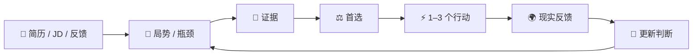

<div align="center">

# 求职军师 · Career Junshi

### 不只帮你改简历，更帮你判断：现在到底该做什么。

**Evidence-grounded Career Decision Agent**

<br/>


[](LICENSE)
[](documentation/MEMORY.md)
[](documentation/MEMORY.md)

<br/>

[快速开始](#-quick-start) · [使用场景](#-使用场景) · [工作流](#-工作流) · [English](README_EN.md)

</div>

一个运行在 Codex 等支持本地 Skill 的助手中的职业决策 Skill。

> 把简历、JD、项目经历、HR 对话、面试反馈或 Offer 交给它，然后直接问：
>
> **“我现在最值得做什么？”**

先判断真正瓶颈，再给一个首选、1–3 个行动，以及继续、停止或转向的条件。

“今晚准备什么？” · “HR 要不要催？” · “主投哪个方向？” · “能不能写主导？” · “两个 Offer 怎么选？”

## ⚡ Quick Start

### 1. 让 Codex 安装

```text
请将 https://github.com/lavine888/Career-Junshi 的 main 分支
安装为 career-junshi 本地 Skill，使用仓库安装器。
先检查已有同名安装，不要覆盖。
安装后验证运行文件，不要替我启用长期记忆。
```

### 2. 开始问

新建聊天，附上你愿意提供的简历和 JD：

```text
请使用 $career-junshi。这是我的简历和 JD。
我明天下午二面，今晚还有 4 个小时。
先判断最大的风险，再给今晚最值得做的 1–3 件事，
以及哪些事情不要浪费时间准备。
```

没有完整简历也能开始：提供当前阶段、目标、经历和截止时间即可。
已有材料先读，只补问会改变建议的信息。[手动安装](#manual-installation)在文末。

## 🧭 使用场景

| 🧭 方向 | 🛡 面试 | ✍️ 经历 |
| --- | --- | --- |
| **主投 AI Product、Technical PM 还是 Quant？** | **明天二面，今晚准备什么？** | **能不能写“主导开发”？** |
| 主投 / 副投 / 探索，找证据缺口与市场验证动作。 | 收敛最高风险，准备贡献、架构与故事防守。 | 审计 Claim，给可辩护的措辞与可能追问。 |

| 📬 招聘 | ⚖️ Offer |
| --- | --- |
| **HR 五天没回，要不要催？** | **两个 Offer 怎么选？** |
| 分清事实与推测，给跟进草稿和停止等待条件。 | 给当前倾向、决定性未知与反转条件。 |

这些是工作流目标，不保证每次判断正确；事实、贡献范围和行动条件仍需核对。

适合校招或社招中的复杂选择、有真实项目但难以讲清的人，以及需要收敛面试准备、复盘方向与反馈的人。
不承担自动海投、代面试、经历编造或 Offer 概率预测；投递、消息、谈薪与 Offer 决定由你执行。

## 为什么使用求职军师？

比较的是工作流侧重点，不是对 ChatGPT 或其他模型能力的排名。

| 一次简历润色的关注点 | Career Junshi 的工作流 |
| --- | --- |
| 先改文案 | 先判断方向、证据、定位、面试、市场或时机，哪个是真正瓶颈 |
| 增强表述 | 保留个人贡献与项目阶段，只写能守住的 Claim |
| 列出改进项 | 优先 1–3 个行动，说明暂时不值得做的工作 |
| 交付当前材料 | 给首选、观察窗口、停止线与反转条件 |
| 聚焦这一次对话 | 经同意后，用本地 Decision → Outcome 记录复盘 |

## 你会得到什么

| 判断局势 | 证据边界 | 行动优先级 | 现实反馈 |
| --- | --- | --- | --- |
| 找真正瓶颈 | 不帮你吹经历 | 收敛到 1–3 件事 | 用新反馈重评判断 |

## 🔁 工作流

> **用证据作决定，把行动交给现实检验。**
>
> **Evidence → Decision → Action → Reality → Update**



记忆可选；不开记忆，也可以把新反馈带回对话。

## 一个完整例子

**合成示意**，不是独立模型评测或真实面试结果。

### 输入

> 明天下午 AI 产品二面。一面深入问了文档检索原型架构，我感觉答得一般。
> 团队完成项目；我负责评测与失败分类，队友实现服务。JD 要求解释架构取舍。今晚还有 4 小时。

### 军师判断

**今晚优先守住项目的架构取舍、个人贡献和失败模式。**
已有追问信号值得准备，但“感觉答得一般”不证明技术能力不足。

### 今晚做什么

1. **30 分钟核对贡献与阶段。** 按自述整理：“参与团队文档检索原型，负责评测与失败分类。”仍需贡献证据。
2. **90 分钟练五层追问。** 做了什么、为什么、替代方案、测量、失败；只讲自己理解与参与过的部分。
3. **45 分钟练 90 秒真实故事。** 记下答不上来的边界，剩余时间留给休息。

到计划结束就停止准备；面试后记录实际追问与明确反馈，再调整下一轮。

### 不要做

今晚不要新建项目或重新学一整套 Agent 框架。

### 什么会改变判断

如果招聘方明确二面改为商业 case，重新分配准备时间。

更多完整材料与产物：[面试](cases/interview) · [HR 跟进](cases/follow-up) · [Offer](cases/offer) · [全部案例](cases)。

## 🛡 不帮你吹经历

> 强表述，应该经得起追问。

| 看起来很像 | 但不能直接等于 |
| --- | --- |
| 团队成果 | 个人独立实现 |
| Demo | Production |
| 回测结果 | 实盘收益 |
| 参赛 | 获奖 |
| HR 沉默 | 拒绝 |
| 面试通过 | 某个准备策略导致通过 |

先核查证据，再调整措辞：

| Claim 可信度 | 含义 |
| --- | --- |
| VERIFIED | 已针对精确主张核查直接证据，表述受核查范围限制 |
| SUPPORTED | 有支持材料，未完整独立核实 |
| SELF_REPORTED | 本人陈述，尚未独立核实 |
| PLANNED | 计划或未完成工作，不能写成既成成果 |

局势另分 **FACT / INFERENCE / UNKNOWN**：有来源的观察或陈述、推断、尚未确认的信息。
FACT 不是独立真实性认证；链接或源码存在也不证明个人作者身份。

证据弱，就补证或收窄表述。脚本不能认证虚构核查记录，文本规则也不能替代语义审阅。
详见 [Evidence](documentation/EVIDENCE.md)。

## 🧠 记忆与隐私

**Memory is optional.** 不开记忆，也能完整使用。只有明确同意后，才在本地记录压缩后的
**Situation → Decision → Outcome → Learning**。

完整简历、JD、邮件与聊天默认不写入记忆。SQLite 位于安装目录之外，支持查看、暂停、撤销与删除。
数据库未加密，删除不保证擦除外部备份。

本地优先指辅助脚本与记忆存储；对话材料仍受宿主数据政策约束，不代表模型完全离线。
无需私人 Vault 或 LavineOS。授权、位置与命令见 [Memory](documentation/MEMORY.md)。

## 🏗 架构

当前 main：**用户材料 → 局势与证据 → 决策 → 行动 → 结果 → 经同意的记忆**。

宿主理解材料并形成对话判断；Python 提供结构化决策支持、证据检查、材料生成与本地记忆。
CLI 不直接理解任意简历、抓取岗位或发送消息。详见 [Architecture](documentation/ARCHITECTURE.md)
与 [Decision Intelligence](documentation/DECISION_INTELLIGENCE.md)。

## 🧪 项目状态

| 版本 | 重点 | 状态 |
| --- | --- | --- |
| [v0.1](documentation/MVP_REPORT.md) | 证据安全 MVP | 实现与合成检查完成 |
| [v0.2](documentation/V02_REPORT.md) | Decision Intelligence | 已实现 / 有限评测 |
| [v0.2.2](documentation/V022_DECISION_QUALITY_REPORT.md) | Decision Quality | 补丁完成 / 保留弱点 |
| [v0.2.3](documentation/V023_HOLDOUT_EVAL.md) | Holdout Generalization | **当前 main** |
| [v0.3](https://github.com/lavine888/Career-Junshi/tree/experiment/v0.3-host-first) | Host-First 实验 | **EXPERIMENTAL / 评测未完成** |

> **当前稳定：** `main / v0.2.3`
>
> **实验：** `experiment/v0.3-host-first`，未合并 main；仅完成 1/10 组 A/B，不能认定架构胜出。
>
> 有合成评测；**现实求职效果尚未得到证明**。

冻结状态与续跑要求见[实验分支说明](https://github.com/lavine888/Career-Junshi/blob/experiment/v0.3-host-first/documentation/V030_RESUME_EVAL.md)。

## 评测与限制

确定性测试、合成基准与冻结 holdout 检查证据边界和决策行为，**不证明提高 Offer 率或面试通过率**。
当前尚未达到直接面向真实用户试点的评测门槛。

提取与结构化交接仍可能失败；部分建议仍泛化、过度谨慎或过早确定。当前岗位、公司、市场与政策需新鲜来源。
自主参考读取曾被宿主策略阻止，见[参考读取实验](documentation/REFERENCE_RETRIEVAL_EVAL.md)。

[评测协议](documentation/EVAL.md) · [v0.2.3 Holdout](documentation/V023_HOLDOUT_EVAL.md) ·
[Mock 调试](documentation/MOCK_CASE_DEBUG_REPORT.md) · [决策质量报告](documentation/V022_DECISION_QUALITY_REPORT.md)

<a id="manual-installation"></a>

<details>
<summary><b>手动安装</b></summary>

需要支持本地 Skill 的宿主（如 Codex）与 Python 3.10+；辅助脚本只用标准库。
项目没有自建模型服务，不要求额外 API key；对话能力来自宿主。

先下载**稳定 main** 并验证：

```sh
git clone --branch main https://github.com/lavine888/Career-Junshi.git
cd Career-Junshi
python scripts/validate_skill.py
```

选择宿主实际扫描的目录。Codex 用户级目录为 `~/.agents/skills`，见
[OpenAI 官方 Skill 文档](https://learn.chatgpt.com/docs/build-skills)；其他宿主按自身配置选择。

### macOS / Linux

```sh
python scripts/install_skill.py --target "$HOME/.agents/skills/career-junshi"
python "$HOME/.agents/skills/career-junshi/scripts/validate_skill.py" --runtime-only
```

### Windows PowerShell

```powershell
python scripts/install_skill.py --target "$env:USERPROFILE\.agents\skills\career-junshi"
python "$env:USERPROFILE\.agents\skills\career-junshi\scripts\validate_skill.py" --runtime-only
```

仅复制运行文件与许可，不带测试、案例、`.git` 或数据库；已有目标报错并保留，不启用记忆。
安装后按 Quick Start 提问。

</details>

<details>
<summary><b>仓库与开发</b></summary>

### 仓库结构

```text
Career-Junshi/
├─ SKILL.md         → 助手行为
├─ scripts/         → 确定性辅助脚本
├─ references/      → 职业知识与行动指南
├─ cases/           → 合成示例
├─ benchmark/       → 基准与冻结评测
├─ documentation/   → 设计与报告
└─ tests/           → 回归测试
```

### 开发与测试

```sh
python -m unittest discover -s tests -v
python scripts/benchmark.py run
python scripts/validate_skill.py
```

### 结构化 CLI

宿主先理解材料、提取来源，CLI 接收结构化 JSON：

```sh
python scripts/junshi.py route --mode interview
python scripts/junshi.py audit --input cases/interview/input.json
python scripts/junshi.py decide --input cases/interview/input.json --now 2026-10-03T12:00:00+08:00
```

`--format json` 查看内部字段；`--artifacts-dir <新的私有目录>` 生成材料，不覆盖已有文件。
见[提取契约](documentation/CONTEXT_EXTRACTION.md)与[决策契约](documentation/DECISION_INTELLIGENCE.md)。
脚本检查通过不等于语义评测通过。

</details>

## 来源与许可

Inspired by / adapted from [Goutoujunshi](https://github.com/shengjidaguai-china/goutoujunshi)：
轻量内核、参考路由、本地记忆，以及行动、观察与停止线。
Conceptually informed by [Career Alpha](https://github.com/lavine888/career-alpha)：
Evidence First、Claim–Evidence Ledger、面试防守与市场反馈。

[MIT](LICENSE)，保留上游许可声明。复用范围见 [Attribution](documentation/ATTRIBUTION.md)。
