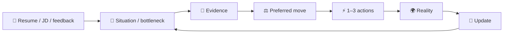

<div align="center">

# Career Junshi · 求职军师

### Go beyond resume edits. Decide what is worth doing next.

**Evidence-grounded Career Decision Agent**

<br/>


[](LICENSE)
[](documentation/MEMORY.md)
[](documentation/MEMORY.md)

<br/>

[Quick Start](#-quick-start) · [Use cases](#-use-cases) · [Workflow](#-workflow) · [中文](README.md)

</div>

A career decision Skill for Codex and other hosts that support local Skills.

> Share your resume, JD, project evidence, recruiter messages, interview feedback or offers, then ask:
>
> **“What should I do next?”**

Identify the bottleneck, recommend a move and 1–3 actions, then specify when to continue, stop or reconsider.

"What should I prepare tonight?" · "Should I follow up with HR?" · "Which roles should I prioritize?" · "Can I claim leadership?" · "Which offer should I choose?"

## ⚡ Quick Start

### 1. Ask Codex to install it

```text
Install career-junshi as a local Skill from the main branch of
https://github.com/lavine888/Career-Junshi, using the repository's installer.
Check for an existing installation first. Do not overwrite it.
Validate the installed runtime files. Do not enable persistent memory for me.
```

### 2. Start asking

Open a new chat and attach the resume and JD you are comfortable sharing:

```text
Use $career-junshi. Here are my resume and JD.
My second interview is tomorrow afternoon. I have four hours tonight.
Identify the biggest risk, recommend the 1–3 most useful actions,
and tell me what preparation I should avoid spending time on.
```

No complete resume required: describe your stage, goal, experience and deadline.
Read supplied context first; ask only about gaps that could change the advice.
[Manual installation](#manual-installation) is below.

## 🧭 Use cases

| 🧭 Direction | 🛡 Interviews | ✍️ Experience |
| --- | --- | --- |
| **AI Product, Technical PM or Quant?** | **What should I prepare tonight?** | **Can I say I led development?** |
| Primary / secondary / exploratory targets, evidence gaps and market checks. | Highest risk and contribution, architecture and story defense. | Claim audit, defensible wording and likely follow-up questions. |

| 📬 Recruiting | ⚖️ Offers |
| --- | --- |
| **Five days of silence: follow up?** | **Which of two offers should I choose?** |
| Facts versus inference, a follow-up draft and a stopping condition. | Current preference, decisive unknowns and reversal conditions. |

These are workflow goals, not guaranteed correct recommendations. Facts, contribution scope and action conditions need review.

For students and experienced applicants facing complex choices, people with real projects they struggle to explain,
and candidates narrowing interview preparation or reviewing directions and feedback.
Outside its scope: mass applications, interviewing for you, invented experience and offer probabilities.
You apply, send messages, negotiate and accept or reject offers.

## Why Career Junshi?

This compares workflow priorities, not the capabilities of ChatGPT or other models.

| A one-off resume edit focuses on | Career Junshi's workflow |
| --- | --- |
| Better wording | Identify the bottleneck: direction, evidence, positioning, interviews, market or timing |
| Stronger claims | Preserve personal contribution and project stage; write defensible claims |
| Possible improvements | Prioritize 1–3 actions and identify effort to avoid |
| The current deliverable | A preferred move, observation window, stopping point and reversal conditions |
| This conversation | Optional, consented local Decision → Outcome records for review |

## What you get

| Situation | Evidence boundaries | Action priorities | Reality feedback |
| --- | --- | --- | --- |
| Find the bottleneck | Keep claims defensible | Focus on 1–3 actions | Reassess with new feedback |

## 🔁 Workflow

> **Make decisions from evidence. Let reality test the actions.**
>
> **Evidence → Decision → Action → Reality → Update**



Memory is optional. Bring new feedback back into the conversation even without it.

## One complete example

**Synthetic illustration**, not an independent model evaluation or real interview outcome.

### Input

> My second AI product interview is tomorrow. The first interviewer probed our document-retrieval prototype's architecture; I felt my answers were weak.
> It was a team project: I owned evaluation and failure classification; a teammate built the service. The JD asks for architectural tradeoffs. I have four hours.

### Judgment

**Prioritize the project's architectural tradeoffs, personal contribution and failure modes tonight.**
The observed questions justify preparation; your impression alone does not establish a technical weakness.

### Tonight's actions

1. **30 minutes: check contribution and stage.** From self-report: “Contributed to a team document-retrieval prototype, responsible for evaluation and failure classification.” Evidence is still needed.
2. **90 minutes: rehearse five layers.** What, why, alternatives, measurement and failures; explain only what you understand and participated in.
3. **45 minutes: practice a truthful 90-second story.** Note what you cannot answer; leave the remaining time for rest.

Stop when the preparation block ends. Record actual questions and explicit feedback afterward, then adjust the next round.

### Avoid

Starting another project or learning an entire new agent framework tonight.

### Reconsider if

The recruiter confirms that the second round is a business case.

Complete materials and artifacts: [interview](cases/interview) · [follow-up](cases/follow-up) · [offer](cases/offer) · [all cases](cases).

## 🛡 Evidence First

> Strong claims should survive follow-up questions.

| Looks similar | Does not establish |
| --- | --- |
| Team results | Sole implementation |
| Demo | Production |
| Backtest results | Live trading returns |
| Participation | An award |
| HR silence | Rejection |
| Passing an interview | Preparation caused success |

Check evidence before polishing wording:

| Claim confidence | Meaning |
| --- | --- |
| VERIFIED | Direct evidence checked for the exact claim; wording stays within that scope |
| SUPPORTED | Supporting material, without complete independent verification |
| SELF_REPORTED | The candidate's account, not independently verified |
| PLANNED | Intended or unfinished work, never a completed achievement |

Situations use **FACT / INFERENCE / UNKNOWN**: sourced observations or reports, interpretations, and things not established.
FACT is not independent truth certification; a link or repository does not prove personal authorship.

Narrow weak claims or build evidence. Scripts cannot authenticate invented receipts; text rules cannot replace semantic review.
See the [evidence contract](documentation/EVIDENCE.md).

## 🧠 Memory & privacy

**Memory is optional.** The Skill works without it. Explicit consent permits compressed local
**Situation → Decision → Outcome → Learning** records.

Raw resumes, JDs, emails and chats are excluded from memory by default. SQLite lives outside the installation;
records can be viewed, paused, revoked or deleted. The database is unencrypted; deletion does not guarantee erasure of external backups.

Local-first describes helpers and storage. Conversation materials remain subject to the host's data policies;
model inference is not guaranteed offline. No private vault or LavineOS is required.
See [memory policy and commands](documentation/MEMORY.md).

## 🏗 Architecture

Current main: **User context → Situation / evidence → Decision → Action → Outcome → Consented memory**.

The host understands materials and provides conversational judgment. Python offers structured decision support,
evidence checks, artifacts and local memory. The CLI does not understand arbitrary resumes, scrape jobs or send messages.
See [architecture](documentation/ARCHITECTURE.md) and [Decision Intelligence](documentation/DECISION_INTELLIGENCE.md).

## 🧪 Project status

| Version | Focus | Status |
| --- | --- | --- |
| [v0.1](documentation/MVP_REPORT.md) | Evidence-safe MVP | Implementation / synthetic checks complete |
| [v0.2](documentation/V02_REPORT.md) | Decision Intelligence | Implemented / limited evaluation |
| [v0.2.2](documentation/V022_DECISION_QUALITY_REPORT.md) | Decision Quality | Patch complete / weaknesses remain |
| [v0.2.3](documentation/V023_HOLDOUT_EVAL.md) | Holdout Generalization | **Current main** |
| [v0.3](https://github.com/lavine888/Career-Junshi/tree/experiment/v0.3-host-first) | Host-First experiment | **EXPERIMENTAL / evaluation incomplete** |

> **Current stable:** `main / v0.2.3`
>
> **Experimental:** `experiment/v0.3-host-first`, not merged into main; only 1/10 A/B groups complete. Superiority is not established.
>
> Synthetic evaluations exist; **real-world hiring effectiveness is not proven**.

See the [experiment freeze and resume instructions](https://github.com/lavine888/Career-Junshi/blob/experiment/v0.3-host-first/documentation/V030_RESUME_EVAL.md).

## Evaluation & limitations

Deterministic tests, synthetic benchmarks and frozen holdouts check integrity and decision behavior.
**They do not prove better offer or interview pass rates.** The gates for a direct real-user pilot have not been met.

Extraction and structured handoffs can fail; advice can be generic, too cautious or prematurely certain.
Current vacancies, companies, markets and policies need fresh sources. Autonomous reference reads were blocked by the host
in the [reference-loading experiment](documentation/REFERENCE_RETRIEVAL_EVAL.md).

[Evaluation protocol](documentation/EVAL.md) · [v0.2.3 holdouts](documentation/V023_HOLDOUT_EVAL.md) ·
[Mock debugging](documentation/MOCK_CASE_DEBUG_REPORT.md) · [Decision Quality](documentation/V022_DECISION_QUALITY_REPORT.md)

<a id="manual-installation"></a>

<details>
<summary><b>Manual installation</b></summary>

A host with local Skill support (such as Codex) and Python 3.10+ are required; helpers use only the standard library.
There is no project-hosted model service or additional API key requirement. The host supplies the model.

Clone **stable main** and validate:

```sh
git clone --branch main https://github.com/lavine888/Career-Junshi.git
cd Career-Junshi
python scripts/validate_skill.py
```

Choose a directory your host discovers. Codex's user-level directory is `~/.agents/skills`; see the
[official OpenAI Skill documentation](https://learn.chatgpt.com/docs/build-skills). Other hosts use their configured location.

### macOS / Linux

```sh
python scripts/install_skill.py --target "$HOME/.agents/skills/career-junshi"
python "$HOME/.agents/skills/career-junshi/scripts/validate_skill.py" --runtime-only
```

### Windows PowerShell

```powershell
python scripts/install_skill.py --target "$env:USERPROFILE\.agents\skills\career-junshi"
python "$env:USERPROFILE\.agents\skills\career-junshi\scripts\validate_skill.py" --runtime-only
```

Only runtime files and license notices are copied, not tests, examples, `.git` or databases.
An existing target is refused and preserved; memory stays off. Then use the Quick Start prompt.

</details>

<details>
<summary><b>Repository & development</b></summary>

### Repository structure

```text
Career-Junshi/
├─ SKILL.md         → agent behavior
├─ scripts/         → deterministic helpers
├─ references/      → career playbooks
├─ cases/           → synthetic examples
├─ benchmark/       → evaluations
├─ documentation/   → design and reports
└─ tests/           → regression
```

### Development & tests

```sh
python -m unittest discover -s tests -v
python scripts/benchmark.py run
python scripts/validate_skill.py
```

### Structured CLI

The host understands materials and extracts sources first; the CLI accepts structured JSON:

```sh
python scripts/junshi.py route --mode interview
python scripts/junshi.py audit --input cases/interview/input.json
python scripts/junshi.py decide --input cases/interview/input.json --now 2026-10-03T12:00:00+08:00
```

`--format json` shows internal fields; `--artifacts-dir <new-private-directory>` creates materials without overwriting files.
See [extraction](documentation/CONTEXT_EXTRACTION.md) and [decision / feedback contracts](documentation/DECISION_INTELLIGENCE.md).
Passing a script check is not a semantic evaluation result.

</details>

## Attribution & license

Inspired by / adapted from [Goutoujunshi](https://github.com/shengjidaguai-china/goutoujunshi):
lightweight kernel, reference routing, local memory, actions, observation windows and stopping conditions.
Conceptually informed by [Career Alpha](https://github.com/lavine888/career-alpha):
Evidence First, the Claim–Evidence Ledger, interview defense and market feedback.

[MIT](LICENSE). Upstream notices are retained; see [attribution and reuse scope](documentation/ATTRIBUTION.md).
