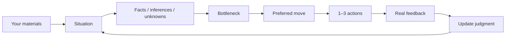

# Career Junshi · 求职军师

> Go beyond resume edits. Decide what is worth doing next.


[](LICENSE)
[](documentation/MEMORY.md)
[](documentation/MEMORY.md)

[中文](README.md) · [Synthetic examples](cases) · [Evaluation & limitations](#evaluation--limitations)

An evidence-grounded Career Decision Agent, delivered as a local Skill for Codex
and other hosts that support Skills. Share your resume, JD, project evidence,
recruiter messages, interview feedback or offers, then ask: **“What should I do next?”**
It identifies the situation and bottleneck, recommends a move and 1–3 actions,
and explains when to continue, stop or reconsider.

- “My second interview is tomorrow. What should I prepare tonight?”
- “HR hasn't replied for five days. Should I follow up?”
- “Should I prioritize AI Product, Technical PM or Quant roles?”
- “Can I honestly say I led this project?”
- “Which of these two offers should I choose?”

## Quick Start

You need a host that supports local Skills, such as Codex. The helper scripts need
Python 3.10+ and use only the standard library. There is no project-hosted model
service or additional API key requirement; the host supplies the conversation model.

**Step 1: ask Codex to install it.** Paste this:

```text
Install career-junshi as a local Skill from the main branch of
https://github.com/lavine888/Career-Junshi.

Use the repository's scripts/install_skill.py and a directory this host discovers.
Check for an existing installation first. Do not overwrite it.
Validate the installed runtime files.
Do not enable persistent memory for me.
```

**Step 2: start a new chat.** Attach the resume and JD you are comfortable sharing:

```text
Use $career-junshi.

Here are my resume and JD.
My second interview is tomorrow afternoon. I have four hours tonight.

Identify the biggest risk first, then recommend the 1–3 most useful actions
and tell me what preparation I should avoid spending time on.
```

You can start without complete documents: describe your stage, goal, relevant
experience and deadline. Supplied context should be read first; only gaps that
could change the advice need follow-up questions. Prefer a terminal? See
[manual installation](#manual-installation).

## Five ways to use it

| Situation | Ask | What the workflow aims to provide |
| --- | --- | --- |
| ① Career direction | “AI Product, Technical PM or Quant: which should I prioritize?” | Primary / secondary / exploratory targets, evidence gaps and market checks |
| ② Interview defense | “What should I prepare for tomorrow?” | Highest risk, at most three priorities, contribution / architecture / story defense |
| ③ Resume claims | “Can I say I led development?” | Claim audit, defensible wording and likely follow-up questions |
| ④ Recruiting progress | “Does five days of silence mean rejection?” | Facts versus inference, whether to follow up, a draft and a stopping condition |
| ⑤ Offer decisions | “Which offer should I choose?” | Current preference, decisive unknowns and reversal conditions |

These are design goals, not a guarantee that each recommendation is correct.
Facts, contribution boundaries and action conditions still need review.

**For:** students and experienced applicants facing complex choices, people with
real projects they struggle to explain, candidates with little preparation time,
and anyone reviewing multiple directions, offers or successive job-search outcomes.

**Outside its scope:** automated mass applications, interviewing on your behalf,
invented experience and offer-probability predictions. You apply, send messages,
negotiate and accept or reject offers.

## Why Career Junshi?

Career questions often need a decision about where effort is worth spending under
the available evidence and constraints. This compares workflow priorities, not
the capabilities of ChatGPT or other models.

| A one-off “help me with my resume” request focuses on | Career Junshi's workflow |
| --- | --- |
| Better wording | Identify whether direction, evidence, positioning, interviews, market or timing is the bottleneck |
| Organizing the supplied story | Separate facts, inferences and unknowns; keep self-report distinct from verification |
| Stronger experience bullets | Preserve team versus personal contribution and project stage |
| Possible improvements | Prioritize 1–3 actions and identify effort to avoid |
| The current document | Optional, consented local Decision → Outcome records for review |
| A revised resume | A preferred move, reversal conditions, observation window and stopping point |

## The workflow in 30 seconds



Memory is optional. You can bring new feedback back into the conversation without it.

## One complete example

This is a **synthetic workflow illustration**, not an independent model evaluation
or a real interview outcome.

**Input**

> My second AI product interview is tomorrow. The first interviewer probed my
> document-retrieval prototype's architecture, and I felt my answers were weak.
> It was a team project: I owned evaluation and failure classification; a teammate
> implemented the service. The JD asks for architectural tradeoffs. I have four hours.

**Judgment**

Prioritize this project's architectural tradeoffs, personal contribution and failure
modes tonight. The observed questions justify preparation; your impression alone
does not establish a technical weakness.

**Three actions**

1. Spend 30 minutes checking contribution and project-stage claims. Prepare:
   “Contributed to a team document-retrieval prototype, responsible for evaluation
   and failure classification.” This reflects self-report and still needs evidence.
2. Spend 90 minutes on five layers: what you did, why, alternatives, measurement
   and failures. Explain only the architecture you understand and participated in.
3. Spend 45 minutes rehearsing a truthful 90-second project story. Note what you
   cannot answer; preserve the remaining time for rest.

**Avoid:** starting another project or learning an entire new agent framework tonight.

**Observe and stop:** finish when the preparation block ends. Record the actual
questions and explicit feedback afterward, then adjust the next round.
**Reconsider if:** the recruiter confirms that the second round is a business case.

More complete inputs and artifacts: [interview](cases/interview),
[recruiter follow-up](cases/follow-up) and [offer](cases/offer).

## Evidence First: keep claims defensible

Check evidence before polishing a claim:

| Claim confidence | Meaning |
| --- | --- |
| VERIFIED | Direct evidence checked for this exact claim; wording remains bounded by that check |
| SUPPORTED | Supporting material exists, without complete independent verification |
| SELF_REPORTED | The candidate's account, not independently verified |
| PLANNED | Intended or unfinished work; never a completed achievement |

Situations separately use **FACT / INFERENCE / UNKNOWN**: a sourced observation or
report, an interpretation, or something not established. FACT is not independent
truth certification. A link or repository does not prove personal authorship.

```text
Team results ≠ sole implementation
Demo ≠ production
Backtest ≠ live trading
Participation ≠ an award
Silence ≠ rejection
Passing an interview ≠ proof that preparation caused success
```

Weak evidence calls for a narrower claim or better evidence. Scripts cannot
authenticate invented verification receipts, and text rules cannot replace semantic
review. See the [evidence contract](documentation/EVIDENCE.md).

## Manual installation

Clone **stable main** and validate the checkout:

```sh
git clone --branch main https://github.com/lavine888/Career-Junshi.git
cd Career-Junshi
python scripts/validate_skill.py
```

Choose a directory your host discovers. Codex's user-level directory is
`~/.agents/skills`; see the [official OpenAI Skill documentation](https://learn.chatgpt.com/docs/build-skills).
Use the configured location for other hosts.

**macOS / Linux**

```sh
python scripts/install_skill.py --target "$HOME/.agents/skills/career-junshi"
python "$HOME/.agents/skills/career-junshi/scripts/validate_skill.py" --runtime-only
```

**Windows PowerShell**

```powershell
python scripts/install_skill.py --target "$env:USERPROFILE\.agents\skills\career-junshi"
python "$env:USERPROFILE\.agents\skills\career-junshi\scripts\validate_skill.py" --runtime-only
```

The installer copies runtime files and license notices, not tests, examples, `.git`
or databases. It refuses an existing target and preserves it. Installation does
not enable memory. After installing, use the Quick Start prompt.

## Memory & privacy

**Memory is optional.** The Skill works without it. Only explicit consent permits
compressed local records of **Situation → Decision → Outcome → Learning**.

Raw resumes, JDs, emails and chats are not written to memory by default. SQLite
lives outside the installation; you can view, pause, revoke or delete records.
It is unencrypted, and deletion does not guarantee erasure of external backups.
Local-first describes helpers and memory storage: conversation materials remain
subject to the host's data policies, and model inference is not guaranteed offline.
No private vault or LavineOS is required. See [memory policy and commands](documentation/MEMORY.md).

## Architecture

Current main: **User context → Situation / evidence → Decision → Action → Outcome
→ Consented memory**. The host understands materials and provides conversational
judgment. Python offers structured decision support, evidence checks, artifacts and
local memory. The CLI accepts structured JSON; it does not understand arbitrary
resumes, scrape jobs or send messages. See [architecture](documentation/ARCHITECTURE.md)
and [Decision Intelligence](documentation/DECISION_INTELLIGENCE.md).

## Project status

| Version | Focus | Status |
| --- | --- | --- |
| [v0.1](documentation/MVP_REPORT.md) | Evidence-safe MVP | Implementation and synthetic checks complete |
| [v0.2](documentation/V02_REPORT.md) | Decision Intelligence | Implemented; limited evaluations complete |
| [v0.2.2](documentation/V022_DECISION_QUALITY_REPORT.md) | Decision Quality | Patch complete; weaknesses retained |
| [v0.2.3](documentation/V023_HOLDOUT_EVAL.md) | Holdout Generalization | **Current main**, with extraction and decision failures remaining |
| [v0.3 Host-First](https://github.com/lavine888/Career-Junshi/tree/experiment/v0.3-host-first) | Architecture experiment | **EXPERIMENTAL / evaluation incomplete**, not merged into main |

Only 1/10 v0.3 A/B groups is complete; architectural superiority is not established.
See the [experiment freeze and resume instructions](https://github.com/lavine888/Career-Junshi/blob/experiment/v0.3-host-first/documentation/V030_RESUME_EVAL.md).

## Evaluation & limitations

Deterministic tests, synthetic decision benchmarks and frozen holdouts check
integrity and decision behavior. **They do not prove better offer rates, interview
pass rates or real-world job-search outcomes.** The current evaluation gates for
a direct real-user pilot have not been met.

Extraction and structured handoffs can fail; some advice remains generic, too
cautious or prematurely certain. Current companies, vacancies, markets and policy
need fresh sources. Autonomous reference reads were blocked by the host in the
[reference-loading experiment](documentation/REFERENCE_RETRIEVAL_EVAL.md).

[Evaluation protocol](documentation/EVAL.md) · [v0.2.3 holdouts](documentation/V023_HOLDOUT_EVAL.md) ·
[Mock case debugging](documentation/MOCK_CASE_DEBUG_REPORT.md) · [Decision Quality report](documentation/V022_DECISION_QUALITY_REPORT.md)

## Repository structure

```text
Career-Junshi/
├── SKILL.md          # Agent behavior
├── scripts/          # Deterministic helpers
├── references/       # Career knowledge and playbooks
├── cases/            # Synthetic examples
├── benchmark/        # Benchmarks and frozen evaluations
├── documentation/    # Architecture, evidence, memory and reports
└── tests/            # Regression tests
```

## Development & tests

```sh
python -m unittest discover -s tests -v
python scripts/benchmark.py run
python scripts/validate_skill.py
```

<details>
<summary>For script users: reproduce structured behavior</summary>

The host understands the materials and extracts sourced context before using helpers:

```sh
python scripts/junshi.py route --mode interview
python scripts/junshi.py audit --input cases/interview/input.json
python scripts/junshi.py decide --input cases/interview/input.json --now 2026-10-03T12:00:00+08:00
```

Use `--format json` for internal fields or `--artifacts-dir <new-private-directory>`
to create materials without overwriting files. See [extraction](documentation/CONTEXT_EXTRACTION.md)
and [decision / feedback contracts](documentation/DECISION_INTELLIGENCE.md).
Passing a script check is not a semantic evaluation result.

</details>

## Attribution & license

Inspired by / adapted from [Goutoujunshi](https://github.com/shengjidaguai-china/goutoujunshi):
lightweight kernel, reference routing, local memory philosophy, action-first
interaction, observation windows and stopping conditions.
Conceptually informed by [Career Alpha](https://github.com/lavine888/career-alpha):
Evidence First, the Claim–Evidence Ledger, interview defense and market feedback.

[MIT](LICENSE). Upstream license notices are retained; see [attribution and reuse scope](documentation/ATTRIBUTION.md).
