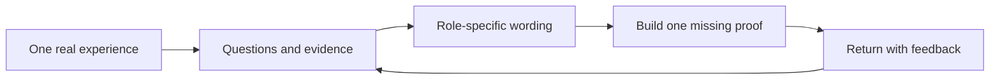

<div align="center">


# Career Junshi · 求职军师

### Turn real experience into a resume you can defend.

Start with one project claim. Clarify ownership, build the missing evidence, choose your next move.

[](LICENSE)

[](documentation/MEMORY.md)

[See it in action](#demo) · [Get started](#start) · [Four experiences](#experiences) · [Evaluation](#evaluation) · [中文](README.md)

</div>

Career Junshi is a career workflow for Codex and other hosts that support local Skills.
For candidates explaining real projects, changing roles, preparing for an interview,
or deciding where to focus their job search.

**Bring real context. Leave with an evidence-grounded judgment and 1–3 useful next actions.**

<a id="demo"></a>

## Can you defend the next question?

> **Resume claim:** “Independently built a production RAG platform, improving accuracy by 30%.”
>
> **Actual account:** A team course prototype. You wrote evaluation scripts and classified
> failures; a teammate built the service. Ten internal questions, no baseline, no production users.

Junshi narrows unsupported wording and starts with the work you actually did:

```text
Junshi: For the ten questions you ran, what made an answer count as a failure?

You: My teammate and I agreed on three checks: missing document citations,
     incorrect cited passages, or an answer contradicting the document.
     I put those checks in the script and recorded the results.

Junshi: That contribution is clearer. It remains your account;
        the code and evaluation records have not been checked.
```

You leave with a sentence you can use now:

> Contributed to a team RAG course prototype, owning evaluation scripts and failure
> classification; evaluated ten internal questions against team-agreed criteria and
> recorded missing citations, incorrect passages, and contradictions with source documents.

**Keep the contribution. Remove the unsupported independence, production claim, and 30% improvement.**
Know exactly what evidence to bring back next.

<sub>Translated and condensed from an actual host trial with anonymous synthetic material, not a real candidate or hiring outcome. See the [trial record](documentation/EVOLUTION_EVAL.md). The [full walkthrough](cases/experiences/defense/example.md) is a separately authored illustration.</sub>

<a id="start"></a>

## Start with one sentence

### 1 · Install

Send this to a host that supports local Skills:

```text
Install career-junshi from the main branch of
https://github.com/lavine888/Career-Junshi using the repository installer.
Check for an existing installation first; do not overwrite it.
Validate the installed runtime files. Do not enable persistent memory.
```

### 2 · Bring one real experience

```text
Use $career-junshi for a resume defense session.

My resume says: ...
What I actually did: ...
Target role / JD: ...
Next interview or deadline: ...

Ask one question at a time and follow my actual answers.
Finish with safe wording, evidence gaps, and the most useful next step.
```

A complete resume is optional. You can also ask to rewrite a paragraph or prioritize
tonight's preparation. Supplied materials come first; questions fill only consequential
gaps. Persistent memory can stay off.

<a id="experiences"></a>

## Four core experiences, one evidence loop

| Where you are stuck | Ask this | What you get |
| --- | --- | --- |
| **🛡 Resume defense** · A project might unravel under questions | “Challenge this claim, one question at a time.” | Clarified points, missing evidence, safe wording, next step |
| **🎯 Role translation** · One project, different target jobs | “Adapt this project to these two JDs and explain each version.” | Shared fact sheet, role versions, rationale and gaps |
| **🧩 Evidence sprint** · A gap needs a bounded task | “I have four hours this week. Close one important evidence gap.” | Deliverable, acceptance criteria, time budget and stopping point |
| **🔄 Decision review** · New feedback changes the picture | “Compare the earlier recommendation with this feedback.” | Prior judgment versus observations, revisions and next action |

Stop a defense session whenever you need. Role versions keep the same facts.
Sprints fit your actual time. Reviews preserve what was unknown rather than
inventing predictions after the event.

**Explore the authored synthetic walkthroughs:** [defense](cases/experiences/defense/example.md) ·
[role translation](cases/experiences/role-translation/example.md) ·
[evidence sprint](cases/experiences/proof-sprint/example.md) ·
[decision review](cases/experiences/decision-review/example.md). Walkthroughs are in Chinese.


```mermaid
flowchart LR
    A["One real experience"] --> B["Questions and evidence"]
    B --> C["Role-specific wording"]
    C --> D["Build one missing proof"]
    D --> E["Return with feedback"]
    E --> B
```

### Three details to try now

| Problem | Ask this | What happens |
| --- | --- | --- |
| Does “led” hold up? Does “improved” imply too much? | “Check verbs, ownership and causality. Change only unsupported promises.” | Keep supported leadership; separate before/after observations from personal attribution |
| Restarting every time a question gets difficult | “Pause and give me a copyable checkpoint.” Paste it next time: “Continue here, one question at a time.” | Preserve the actual question, answer and next question; resume from the supplied record |
| Explaining everything after learning the result | In a fresh chat without the result: “Review only these interview observations first. I will reveal the outcome later.” | Freeze an initial judgment, then compare new information; known results use ordinary review |

Checkpoints stay in chat unless you request otherwise; they do not enable memory.
Outcome-blind review requires a context that has not seen the result. Removing text
cannot make the same conversation forget it, and an outcome alone does not prove causality.

Authored Chinese illustrations: [wording audit](cases/experiences/wording-audit/example.md) ·
[resume from a checkpoint](cases/experiences/defense-resume/example.md) ·
[outcome-blind review](cases/experiences/outcome-blind-review/example.md).

## From real experience to editable application files

```text
Use Career Junshi to prepare a Chinese single-column resume for this JD,
aiming for one page. Explain material cuts and preserve contribution boundaries.
Export LaTeX and plain text to a new private directory I specify.
Compile a PDF if local XeLaTeX is available. Report content, compilation,
PDF text-layer and actual visual checks separately.
```

The flow covers drafting, independent review when the host supports it,
compilation and inspection, with evidence and consent boundaries preserved.
Source export needs no LaTeX installation; PDF compilation needs local XeLaTeX,
fonts and template packages.
Missing compilation or visual review is reported rather than treated as success.

The bundle preserves editable source, plain text, sourced content data and a
verification report. Choose a one- or two-page budget; the helper never silently
cuts content or shrinks fonts. Text extraction is not universal ATS certification.
Private files stay outside Git and the installed Skill; export does not enable
memory, upload documents or submit applications.

[Authored synthetic example](cases/experiences/resume-export/example.md) ·
[Export workflow](references/practical/resume-export.md)

## Bring the rest of your job search, too

| Your question | Junshi's task |
| --- | --- |
| “Which roles should I prioritize?” | Use goals, experience and current JDs to separate primary, secondary and exploratory targets |
| “Interview tomorrow. Only 90 minutes tonight.” | Narrow preparation to the highest risks and 1–3 actions; identify effort to stop |
| “Five days without an HR reply. Follow up?” | Check the conversation, promised dates and workdays; provide timing, a draft and a stop rule |
| “Which offer should I choose?” | Compare personal goals and written terms; identify the preference and unknowns that could reverse it |
| “Run a mock interview for this JD. State what this question observes.” | One job criterion and one question at a time; feedback on actual answers without certifying ability |
| “Which offer terms and payment demands should I verify first?” | Decisive terms, identity and fee risks, verification steps and a reviewable draft |

### When applications stall or preparation never starts

| Ask this | What you get |
| --- | --- |
| “Two application batches had different results. Design a trial within my one-hour budget without assuming the new resume worked better.” | One hypothesis, comparable opportunities, one intended change, a budget and an observation window |
| “I have 15 minutes and keep changing templates. Help me start preparing for tomorrow.” | One inspectable result, a concrete cue, a fallback and a firm stopping point |

Trials preserve versions and denominators. Different roles, channels or follow-up
windows do not establish a template effect. Pending applications remain pending;
plans do not submit applications or create reminders. Start cards address task
obstacles without personality labels or diagnoses.

Ask “What supports this advice, and where might it not apply?” for the study,
population and transfer limits. Research effects are not personal hiring odds.
[Application-trial illustration](cases/experiences/job-search-experiment/example.md) ·
[Start-card illustration](cases/experiences/action-start/example.md) ·
[Methods and research boundaries](references/knowledge/08-research-and-application.md)

## Career reference library

The first collection contains **18 distinct studies and official documents**
across job search, career choice, resumes, interviews, negotiation, offers,
workplace rights and hiring safety. A work used for multiple topics is counted once.

Each card records source type, actual reading depth, scope limits and version.
Meta-analyses, experiments, theory, official guidance and legislation are distinguished;
case-specific legal questions still require current applicable authoritative material.
Ask “What supports this advice, and where does it not apply?” to retrieve relevant cards.

[Browse the index](references/knowledge/08-research-and-application.md).
The collection informs workflow design; it does not establish a hiring benefit for this Skill.

## The real contribution stays intact

Team outcomes are not sole implementation. Prototypes are not production. Plans are
not completed accomplishments. A repository or link alone does not prove authorship,
users, or impact.

Junshi preserves sources, contribution and stage, separating **observations, inference,
and unknowns**. Weak evidence leads to narrower wording and a useful evidence task,
not a candidate score or hiring probability. See the [evidence contract](documentation/EVIDENCE.md).

**You control the actions.** Reports can stay in chat; specify a destination when requesting
files. You apply, send messages, negotiate and choose offers. Shareable drafts use only
selected content and are never posted automatically.

**Memory is optional.** Explicit consent enables compact local decision and feedback
records; full resumes, JDs and conversations are excluded by default. View, pause,
revoke and delete are available. The database is unencrypted; deletion cannot guarantee
erasure of external backups. Local storage does not mean offline model inference;
conversation materials remain subject to the host's data policies. See [memory](documentation/MEMORY.md).

<a id="evaluation"></a>

## What has been checked

The current implementation has **237 automated tests**, **13 structured synthetic
benchmark cases**, and limited independent host trials of the four core experiences.
These check software behavior and evidence boundaries; they do not establish improved
interview or offer rates.
The wording audit, checkpoint continuation and two-stage review also received fresh-context
trials, including a known-outcome boundary check. See the [detail evaluation](documentation/REFINEMENT_EVAL.md).
Source export, missing-compiler behavior and PDF verification limits are recorded
in the [resume-export evaluation](documentation/RESUME_EXPORT_EVAL.md).
Independent trials of application experiments, action starts and research transfer
are recorded in the [research-workflow evaluation](documentation/RESEARCH_EVOLUTION_EVAL.md).
Source-library checks and fresh-context interview and offer trials are recorded
in the [career-library evaluation](documentation/CAREER_LIBRARY_EVAL.md).

Known weaknesses remain in existing holdouts. Extraction and handoffs can fail, and
advice can be generic or too cautious. This iteration does not rerun every frozen
evaluation or claim that the earlier real-user pilot gates have been met. Current
hiring information still needs fresh sources.

[Evolution plan](documentation/EVOLUTION_PLAN.md) · [Core experience evaluation](documentation/EVOLUTION_EVAL.md) ·
[Evaluation protocol](documentation/EVAL.md) · [Frozen holdouts](documentation/V023_HOLDOUT_EVAL.md)

<details>
<summary><b>Manual installation</b></summary>

A host with local Skill support and Python 3.10+ are required. Helpers use only the
standard library; the project does not run its own model service.

```sh
git clone --branch main https://github.com/lavine888/Career-Junshi.git
cd Career-Junshi
python scripts/validate_skill.py
python scripts/install_skill.py --target /path/to/your/skills/career-junshi
python /path/to/your/skills/career-junshi/scripts/validate_skill.py --runtime-only
```

Replace `/path/to/your/skills` with a directory your host discovers, including on Windows.
The target folder must be named `career-junshi`; existing targets are refused and preserved.
Installation copies runtime files and license notices, not examples, tests, `.git` or
databases. It does not enable memory.

</details>

<details>
<summary><b>Development, architecture and structured CLI</b></summary>

The host understands context and conducts conversations. Python supplies bounded
structured support, evidence checks, artifacts and optional memory. `route --experience`
selects references; it does not run a conversation or generate a report.

```sh
python -m unittest discover -s tests -v
python scripts/benchmark.py run
python scripts/validate_skill.py
python scripts/junshi.py route --mode interview --experience defense
python scripts/junshi.py resume-export --input /private/reviewed-resume.json --output-dir /private/new-resume
python scripts/junshi.py sources --topic interview
python scripts/junshi.py sources --id R7
```

The entrypoint is [SKILL.md](SKILL.md), playbooks are in [references](references), synthetic
materials in [cases](cases), and checks and reports in [tests](tests) and [documentation](documentation).

[Architecture](documentation/ARCHITECTURE.md) · [Extraction](documentation/CONTEXT_EXTRACTION.md) ·
[Decision contracts](documentation/DECISION_INTELLIGENCE.md) · [Optional snapshot import](documentation/INTEGRATION.md) ·
[Issues and ideas](https://github.com/lavine888/Career-Junshi/issues)

The separate [v0.3 Host-First experiment](https://github.com/lavine888/Career-Junshi/tree/experiment/v0.3-host-first)
is incomplete and is not evidence of architectural superiority for this iteration.

</details>

---

[MIT](LICENSE)
