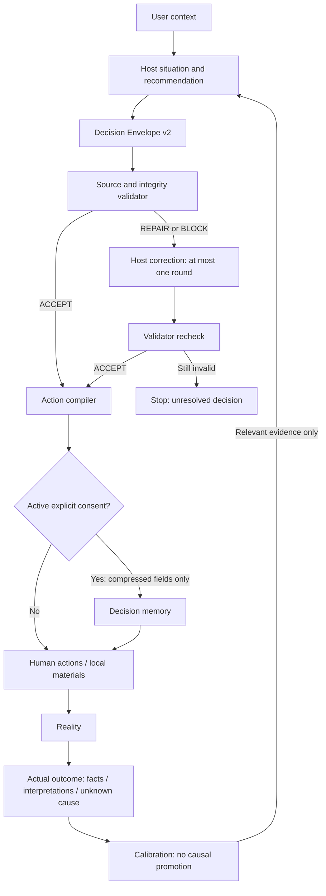

# Host-first decision architecture

**LLM decides. Code verifies. Memory remembers. Reality calibrates.**

The v0.2.3 four-layer holdout produced 3 PASS / 3 PARTIAL / 4 FAIL after three
general fixes, while the separate host layer produced 9 PASS / 1 PARTIAL. H03's
friend interpretation could reject the structured packet; H06 needed catalog
relaxation; H08's supplied projects still led to generic discovery; H10's truthful
spoken recovery was richer than compiled templates. This reveals a representation
and authority ceiling, not evidence that all host judgments are correct.

## Authority and state

The host interprets ambiguous context, goals, tradeoffs, alternatives, sufficiency,
bottleneck, recommendation, information value and next actions. Envelope v2 carries
that judgment; it is not input for a second career-ranking algorithm. Python checks
source IDs/quotes, explicit confidence, bounded actions and evidence boundaries,
calculates explicit deadline intervals, and compiles supplied Markdown. It preserves
Claim audit, identity/correction, consent, append-only state and outcome separation.
There is no new database, agent, mode, frontend or career scoring engine.

## Validation boundary

The validator produces ACCEPT / REPAIR_REQUIRED / BLOCK and field-specific issues.
WARNING excludes optional metadata while retaining usable judgment. REPAIR_REQUIRED
returns a valid move for wording correction; BLOCK asks the host to reconsider an
invalid essential premise. Exactly one repair round is permitted and recorded.
The compiler revalidates before use; a saved status or safe_fields list cannot
authorize edited content. Failed repairs do not become generic fallback advice.
See [Decision Envelope](DECISION_ENVELOPE.md) for the executable contract/CLI.

Source spans, bilingual patterns and operator-attested evidence cannot prove all
natural-language entailments. Ambiguous scope, implicit dependency, negation and
mixed-source claims still need host/human review. ACCEPT means specified checks
passed, not truthful advice certified. Unsupported choices cannot be repaired by
inventing evidence. Legitimate unusual preferences remain host decisions.

## Memory interaction

The existing store receives summary, move, why, evidence IDs, expected observation,
reconsideration, stop and scoped claim references. It stores no source transcript.
No implicit consent, schema migration or history overwrite is introduced. Existing
consent state, paused/revoked gates, correction invalidation and deduplicated recall
continue. Relevant comparable history can be supplied to the host; code never makes
it the current bottleneck automatically in this flow. Current envelope decisions
remain unchanged when a past interview emphasized ownership.

## Experiment gate

`host-decide` initially remains an experimental alternate path. Legacy
`scripts/decision.py`, `decision_quality.py` and `decide` remain unchanged for
regression/fallback/comparison. Adoption requires a fresh A/B evaluation on the
immutable ten-case corpus, same actual gpt-5.6-sol/high, raw inputs, reference
bytes and CONTROLLED_PRELOAD. No autonomous reference-loading experiment is mixed
in. The evaluation report determines YES (primary), MIXED (experimental) or NO
(withdraw experiment). No real-user pilot starts during this task.
